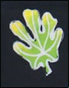
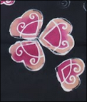

Motif Batik Suroboyo merupakan representasi visual dari kekayaan budaya dan sejarah Kota Surabaya. Dalam satu kain, terkandung tujuh unsur utama yang menjadi simbol khas daerah, mulai dari motif semanggi, tarian remo, hingga ilir ilir. Setiap elemen tidak hanya berfungsi sebagai hiasan, tetapi juga mengandung makna mendalam yang mencerminkan jati diri masyarakat Surabaya.

Motif semanggi, misalnya, diambil dari ikon kuliner khas Surabaya, yakni pecel semanggi. Kehadiran semanggi dalam motif ini menjadi simbol kerakyatan, kesederhanaan, dan kekuatan lokal yang telah menjadi bagian dari kehidupan sehari-hari warga kota. Di sisi lain, motif tarian remo melambangkan semangat, keberanian, dan energi khas pemuda-pemudi Surabaya yang tercermin melalui gerakan dinamis **penari** remo.

Motif ilir ilir dan unsur lain seperti ikon sejarah serta kekayaan alam Surabaya turut melengkapi narasi visual batik ini. Penggunaan warna dan susunan motif yang harmonis menciptakan karya seni yang tidak hanya indah dipandang, tetapi juga sarat makna. Batik Suroboyo menjadi media ekspresi budaya yang hidup, menjembatani masa lalu dan masa kini melalui kain yang bercerita.

Dengan mengusung semangat lokalitas, motif ini tidak hanya memperkuat identitas batik sebagai warisan budaya, tetapi juga mengangkat citra Surabaya sebagai kota yang kaya akan nilai, cerita, dan simbol perjuangan. Batik Suroboyo bukan sekadar kain, melainkan narasi visual tentang kota dan masyarakatnya.
